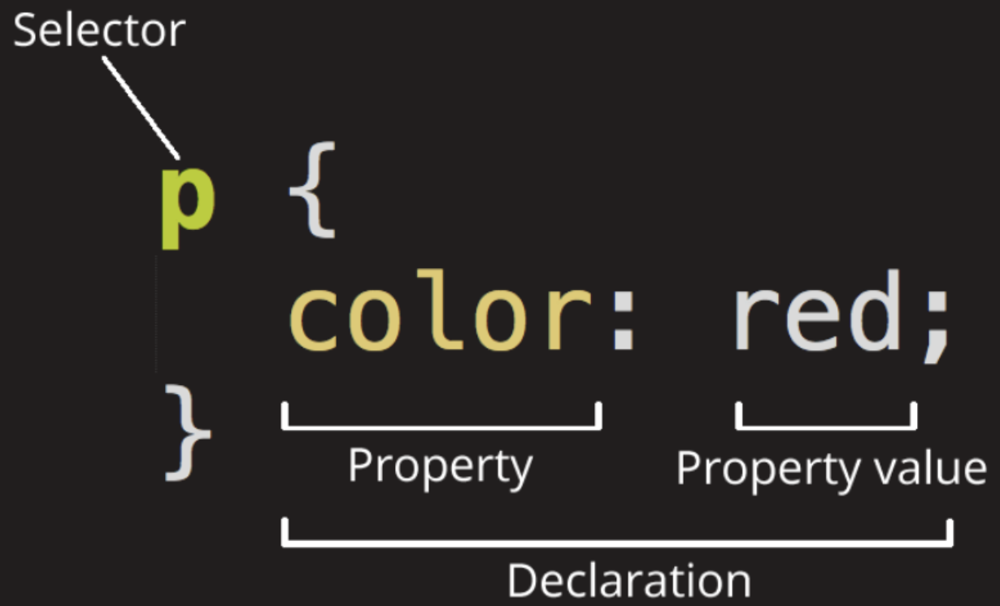
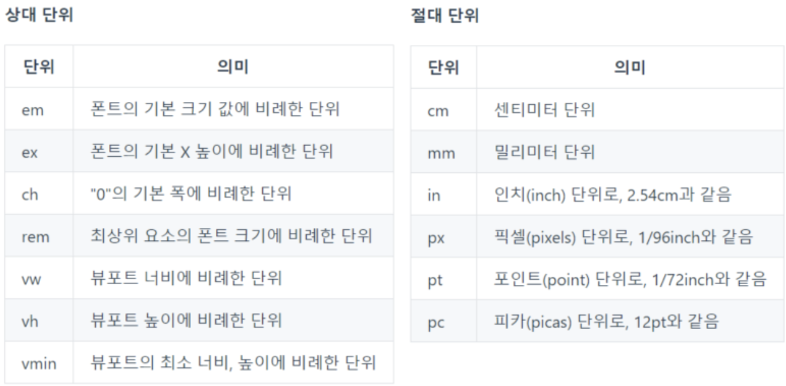

# [Casading Style Sheet](https://developer.mozilla.org/ko/docs/Learn/Getting_started_with_the_web/CSS_basics)
- HTML와 같이 CSS는 실제로 프로그래밍 언어는 아닙니다. 마크업(markup) 언어 도 아닙니다.
- Style sheet 언어 입니다. HTML 문서에 있는 요소들에 선택적으로 스타일을 적용할 수 있다는 말입니다.
- [웹 브라우저별 CSS3 지원 수준 Test 사이트](https://css3test.com/)를 통해 확인할 수 있습니다.

예를 들면, HTML 페이지에서 모든 문단 요소들을 선택하고 그 문단 요소들 안에 있는 텍스트를 빨갛게 바꾸려고 한다면 다음과 같이 CSS를 작성할 것입니다.
```css
p {
  color: red;
}
```

---


---
# CSS 사용의 의의
- 스타일 사용의 중요한 의의는 문서의 구조와 표현을 분리할 수 있다는 점입니다.
- 이는 구조와 표현을 분리함으로써 문서 구조의 수정 없이 스타일의 변경만으로 다양한 표현을 할 수 있다는 것을 의미하며, 웹 사이트에서도 동일한 장점을 가집니다.

---


---
# CSS 사용법
[연습하기 좋은 싸이트](https://flukeout.github.io/)
- [selector](./selector.md)
  - 선택자(selecters)를 사용하면 DOM 요소의 다양한 기능에 기반한 조건을 통해 스타일을 입힐 수 있습니다.
- [text](./text.md)
- [box 모델](./box.md)
- [색상과 배경](./color.md)
- [테두리](./border.md)
  - border는 요소 박스의 테두리를 의미합니다.
  - CSS는 요소를 사각형의 박스로 표시하기 때문에 border 역시 사각형으로 그려집니다.

---
- 요소 박스의 배치
  - [position](./position.md): static, absolute, relative, fixed
  - [float](./float.md)
  - [flex](./flex.md)
  - [grid](./grid.md)
- [다단 구조](./column.md)
- [transform](./transform.md)
- [animation](./animation.md)


---
# css 주석
```css
/* CSS에서 사용할 수 있는 주석입니다. */
```

---
# css 단위


---
# css 적용 
```html
<!DOCTYPE html>
<html lang="ko-KR">
  <head>
    <meta charset="utf-8">
    <title>External Style Sheet</title>
    <link rel="stylesheet" href="css/style.css">
  </head>
  <body>
    <h1>External 방식</h1>
    <p>&lt;link&gt; 요소를 사용하여 외부에 생성한 CSS 파일을 연결합니다.</p>
  </body>
</html>
```

---
# CSS 우선 적용 순서 
1. 속성 값 뒤에 !important 를 붙인 속성
2. HTML에서 style을 직접 지정한 속성
3. #id 로 지정한 속성
4. .클래스, :추상클래스 로 지정한 속성
5. 태그이름 으로 지정한 속성
6. 상위 객체에 의해 상속된 속성

같은 우선 순위에 있는 경우, 부모-자식 관계가 많은 경우가 우선되며, 모든 설정이 같은 경우 나중에 선언한 것이 우선되어 적용됩니다.

---


---
# [CSS Frameworks](https://hackr.io/blog/best-css-frameworks)
- https://github.com/troxler/awesome-css-frameworks


---
## [State of CSS report for 2021](https://2021.stateofcss.com/en-US/technologies/css-frameworks/)
- [Bootstrap](https://getbootstrap.com/docs/3.4/)
- [Tailwind](https://tailwindcss.com/)


