# [Grid](https://heropy.blog/2019/08/17/css-grid/)
- https://naradesign.github.io/css-grid-layout.html
- https://nykim.work/59

## Flex vs Grid
- Flex는 한 방향 레이아웃 시스템이고 (1차원)
- Grid는 두 방향(가로-세로) 레이아웃 시스템 (2차원)

---


---
# 용어 정리 


---
# 속성 
- 컨테이너에 적용하는 속성
- 아이템에 적용하는 속성

이렇게 두 가지로 나뉘어요.

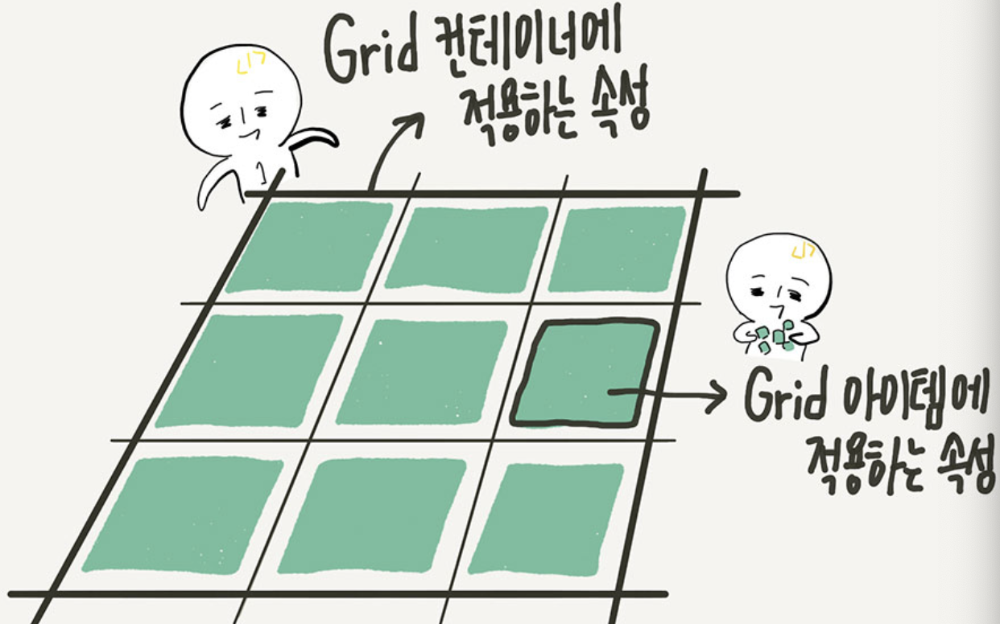

---
## 1. Grid Containers 속성
- display
  - 그리드를 사용하기 위해 컨테이너에 필수로 작성합니다.
  - Grid Container(컨테이너)를 정의합니다.
  - 정의된 컨테이너의 자식 요소들은 자동으로 Grid Items(아이템)로 정의됩니다.

```css
.container {
  display: grid;
}
```
---


---
- grid-template-rows/columns
  - 명시적 행/열(Track)의 크기를 정의합니다.
  - 동시에 라인(Line)의 이름도 정의할 수 있습니다.
  - `fr(fraction, 공간 비율)` 단위를 사용할 수 있습니다.
  - `repeat()` 함수를 사용할 수 있습니다.

```css
.container {
  width: 400px;
  display: grid;
  grid-template-rows: repeat(3, 100px);
  grid-template-columns: repeat(3, 1fr);
}
```
---


---
- grid-template-areas
지정된 그리드 영역 이름(grid-area)을 참조해 그리드 템플릿을 생성합니다.

```css
.container {
  display: grid;
  grid-template-rows: repeat(3, 100px);
  grid-template-columns: repeat(3, 1fr);
  grid-template-areas:
    "header header header"
    "main main aside"
    "footer footer footer";
}
header { grid-area: header; }
main   { grid-area: main;   }
aside  { grid-area: aside;  }
footer { grid-area: footer; }
```
---
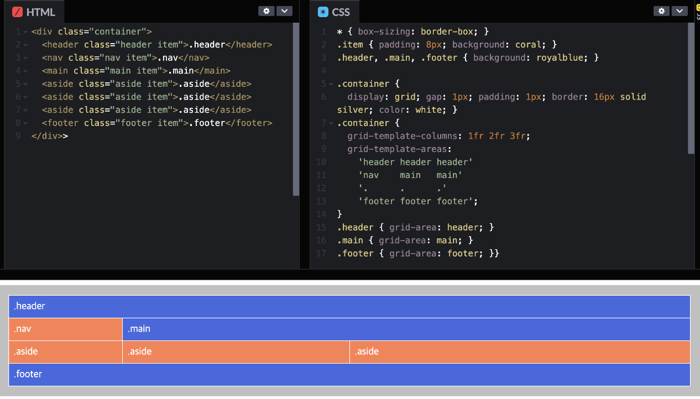

---
- row-gap:
각 행과 행 사이의 간격(Gutter)을 지정합니다.
- column-gap:
각 열과 열 사이의 간격(Gutter)을 지정합니다.
- gap:
각 행과 행, 열과 열 사이의 간격(Gutter)을 지정합니다.

---
```css
.container {
  display: grid;
  grid-template-rows: repeat(2, 150px);
  grid-template-columns: repeat(3, 1fr);
  gap: 20px 10px;
}
/* 하나의 값으로 통일할 수 있습니다. */
.container {
  gap: 10px;  /* row-gap: 10px; + column-gap: 10px; */
}
/* 하나의 값만 적용하고자 한다면 다음과 같이 사용할 수 있습니다. */
.container {
  gap: 10px 0; /* row-gap */
  gap: 0 10px; /* column-gap */
}
```
---
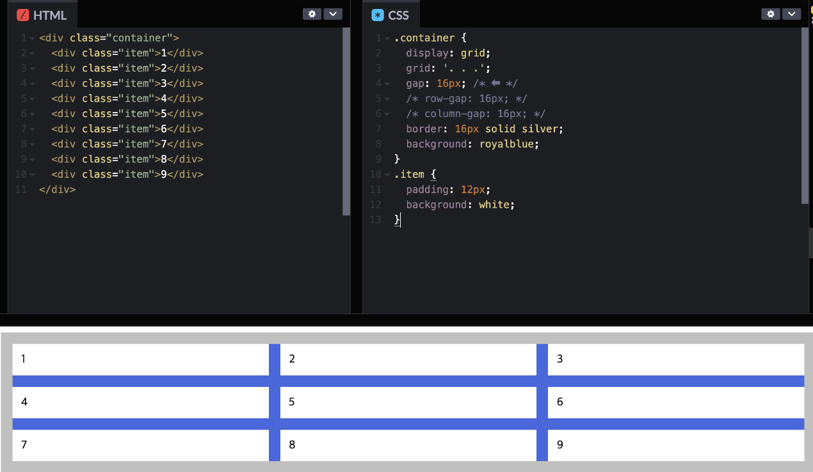

---
- [grid-auto-flow](https://naradesign.github.io/css-grid-layout.html#grid-auto-flow)
배치하지 않은 아이템(Item)을 어떤 방식의 ‘자동 배치 알고리즘’으로 처리할지 정의합니다.

```css
/* For row & row dense */
.container {
  display: grid;
  grid-template-rows: repeat(3, 1fr);
  grid-template-columns: repeat(3, 1fr);
  grid-auto-flow: row || row dense || dense;
}
.item:nth-child(2) {
  grid-column: span 3;
}
```
---
```css
/* For column & column dense */
.container {
  display: grid;
  grid-template-rows: repeat(3, 1fr);
  grid-template-columns: repeat(3, 1fr);
  grid-auto-flow: column || column dense;
}
.item:nth-child(1) {
  grid-column: 2 / span 2;
}
.item:nth-child(2) {
  grid-column: span 2;
}
```
---
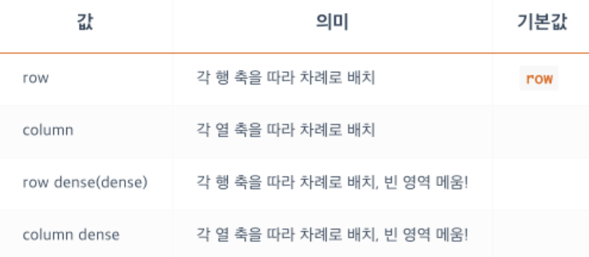

---
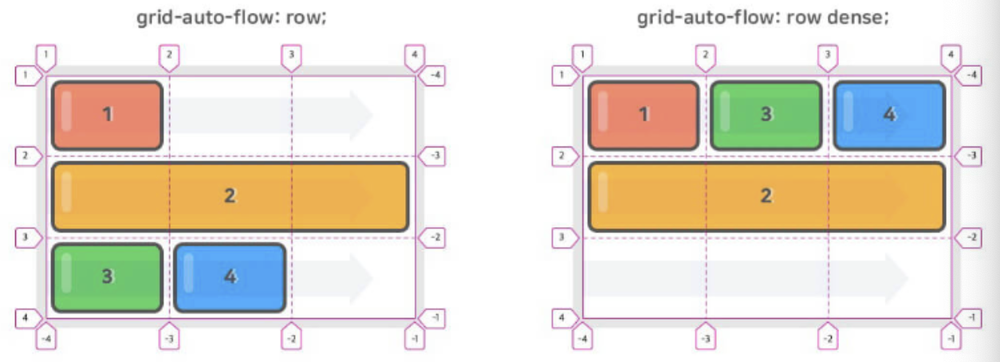

---


---
- align-content
  - 그리드 콘텐츠(Contents)를 수직(열 축) 정렬합니다.
  - 그리드 콘텐츠의 세로 너비가 그리드 컨테이너(Container)보다 작아야 합니다.

```css
.container {
  width: 450px;
  height: 450px;
  display: grid;
  grid-template-rows: repeat(3, 100px);
  grid-template-columns: repeat(3, 100px);
  align-content: center;
}
```
---
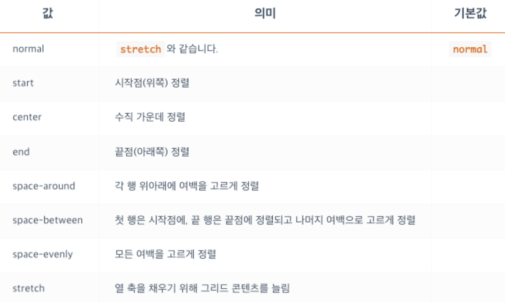

---
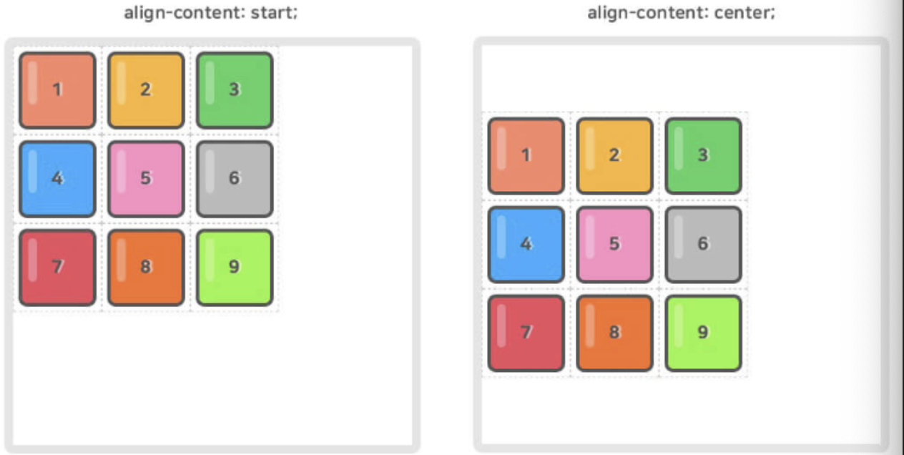

---
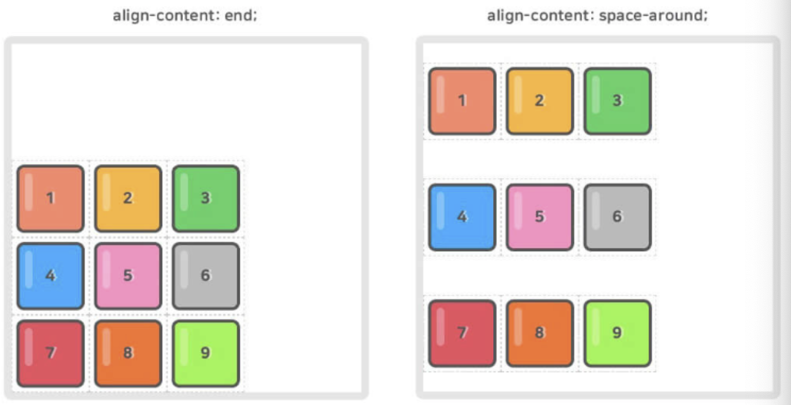

---
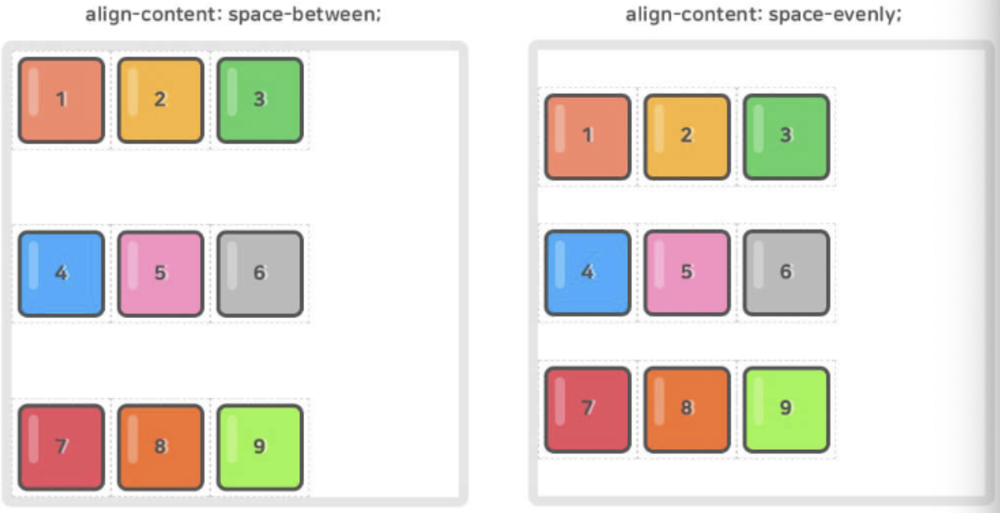

---
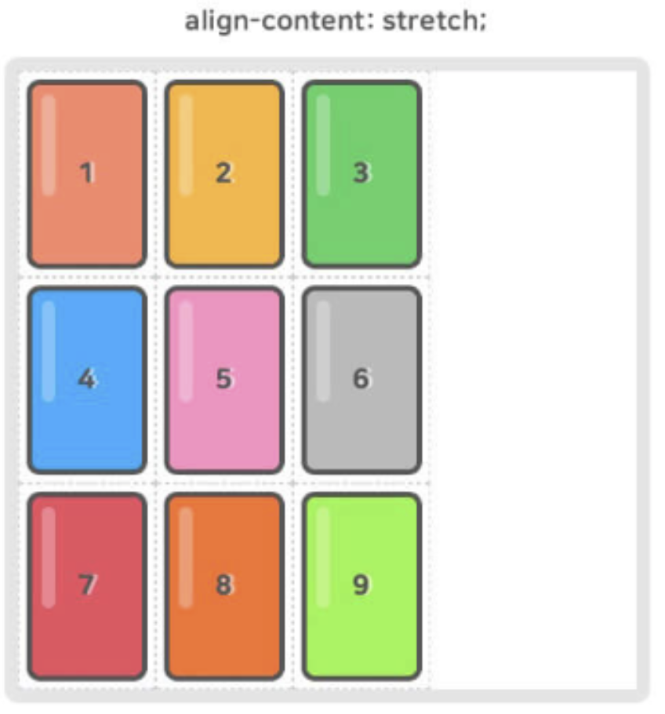

---
- justify-content
  - 그리드 콘텐츠(Contents)를 수평(행 축) 정렬합니다.
  - 그리드 콘텐츠의 가로 너비가 그리드 컨테이너(Container)보다 작아야 합니다.

```css
.container {
  width: 450px;
  height: 450px;
  display: grid;
  grid-template-rows: repeat(3, 100px);
  grid-template-columns: repeat(3, 100px);
  justify-content: <justify-content>;
}
```
---


---


---
- align-items
  - 그리드 아이템(Items)들을 수직(열 축) 정렬합니다.
  - 그리드 아이템의 세로 너비가 자신이 속한 그리드 행(Track)의 크기보다 작아야 합니다.

```css
.container {
  width: 450px;
  height: 450px;
  display: grid;
  grid-template-rows: repeat(3, 1fr);
  grid-template-columns: repeat(3, 1fr);
  align-items: <align-items>;
}
```
---


---
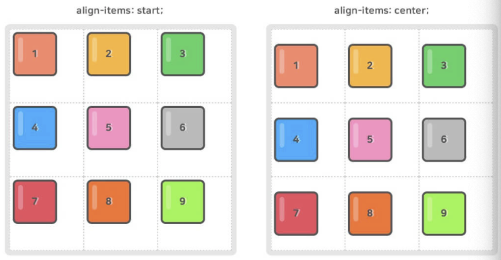

---
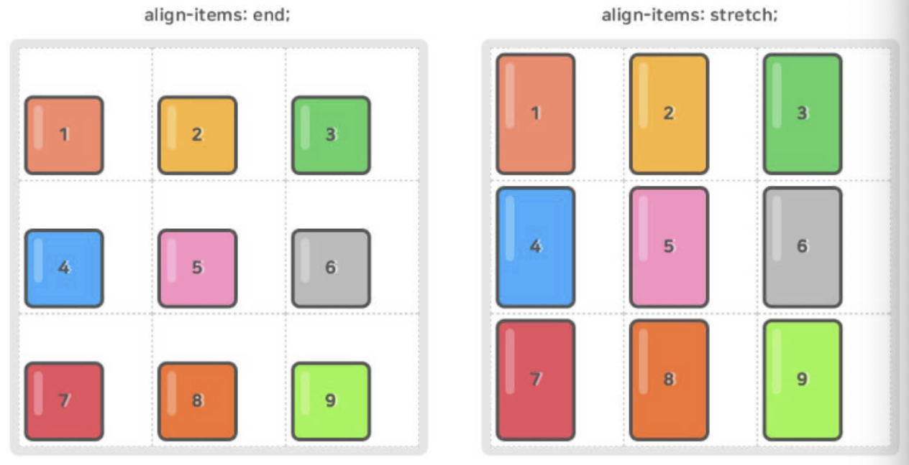

---
- justify-items
  - 그리드 아이템(Items)들을 수평(행 축) 정렬합니다.
  - 그리드 아이템의 가로 너비가 자신이 속한 그리드 열(Track)의 크기보다 작아야 합니다.

```css
.container {
  width: 450px;
  height: 450px;
  display: grid;
  grid-template-rows: repeat(3, 1fr);
  grid-template-columns: repeat(3, 1fr);
  justify-items: <justify-items>;
}
```
---
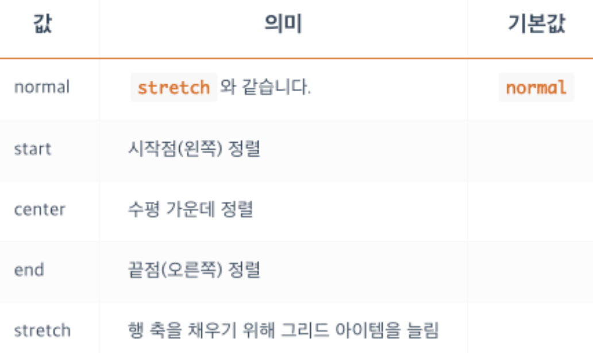

---
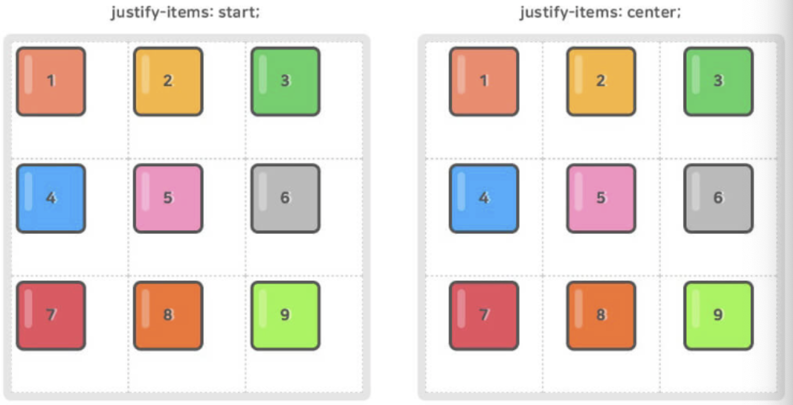

---
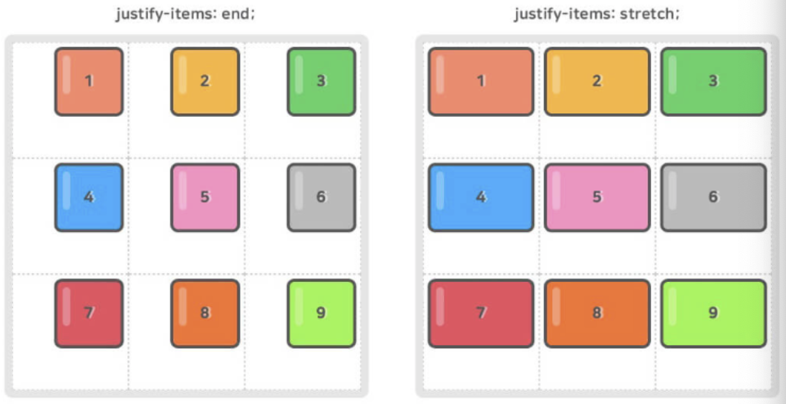

---
## 2. Grid Items 속성
정의된 컨테이너의 자식 요소들은 자동으로 Grid Items(아이템)로 정의됩니다.
- align-self
  - 단일 그리드 아이템(Item)을 수직(열 축) 정렬합니다.
  - 그리드 아이템의 세로 너비가 자신이 속한 그리드 행(Track)의 크기보다 작아야 합니다.

```css
.container {
  display: grid;
  grid-template-rows: repeat(2, 1fr);
  grid-template-columns: repeat(2, 1fr);
}
.item:nth-child(1) { align-self: start; }
.item:nth-child(2) { align-self: center; }
.item:nth-child(3) { align-self: end; }
.item:nth-child(4) { align-self: stretch; }
```
---


---
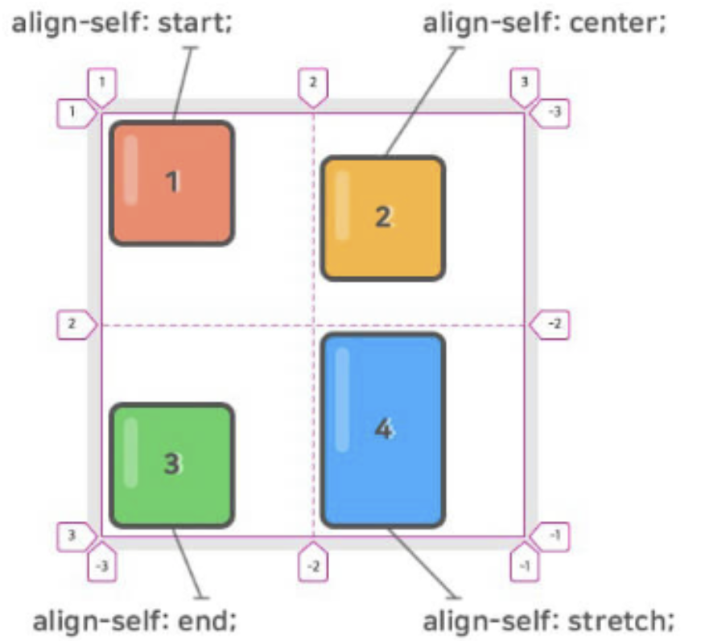

---
- justify-self
  - 단일 그리드 아이템(Item)을 수평(행 축) 정렬합니다.
  - 그리드 아이템의 가로 너비가 자신이 속한 그리드 열(Track)의 크기보다 작아야 합니다.

```css
.container {
  display: grid;
  grid-template-rows: repeat(2, 1fr);
  grid-template-columns: repeat(2, 1fr);
}
.item:nth-child(1) { justify-self: start; }
.item:nth-child(2) { justify-self: center; }
.item:nth-child(3) { justify-self: end; }
.item:nth-child(4) { justify-self: stretch; }
```
---
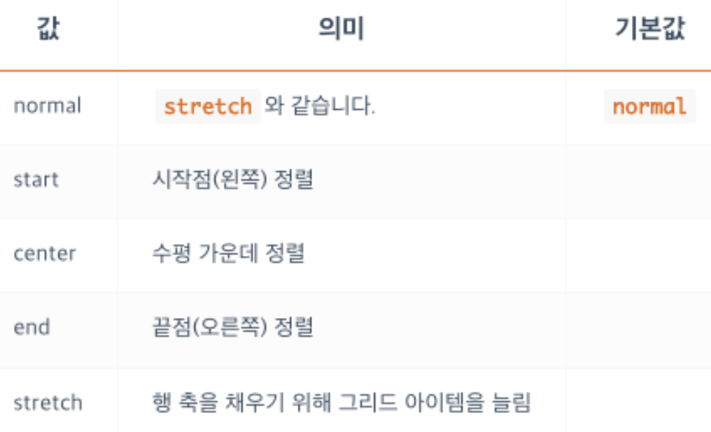

---
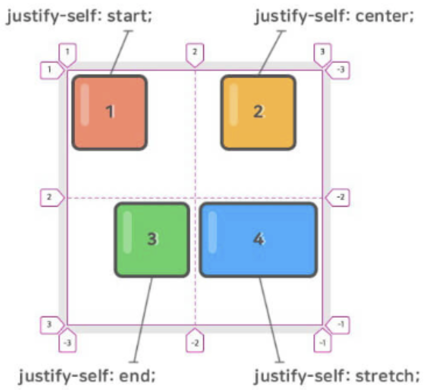

---
- order
  - 그리드 아이템이 자동 배치되는 순서를 변경할 수 있습니다.
  - 숫자가 작을수록 앞서 배치됩니다.

```css
.container {
  display: grid;
  grid-template-rows: repeat(2, 1fr);
  grid-template-columns: repeat(3, 1fr);
}
.item:nth-child(1) { order: 1; }
.item:nth-child(3) { order: 5; }
.item:nth-child(5) { order: -1; }
```
---


---
- z-index
  - z-index 속성을 이용해 아이템이 쌓이는 순서를 변경할 수 있습니다.

```css
.item:nth-child(1) {
  grid-area: 1 / 1 / 2 / 3;
}
.item:nth-child(2) {
  grid-area: 1 / 2 / 3 / 3;
  z-index: 1;
}
.item:nth-child(3) {
  grid-area: 2 / 2 / 3 / 4;
}
```
---


---
# Grid Functions
- repeat()
  - `repeat()` 함수는 행/열(Track)의 크기 정의를 반복합니다.
  - ‘반복되는 횟수’와 ‘행/열의 크기 정의’를 인수로 사용합니다.
  - `grid-template-rows`와 `grid-template-columns`에서 사용합니다.

```css
/* 9컬럼 그리드 */
.container {
  grid-template-columns: 100px 100px 100px 100px 100px 100px 100px 100px 100px;
}
.container {
  grid-template-columns: repeat(9, 100px);
}
```
---
- minmax()
  - minmax() 함수는 행/열(Track)의 ‘최소/최대 크기’를 정의합니다.
  - 첫 번째 인수는 ‘최솟값’이고 두 번째 인수는 ‘최댓값’입니다.
  - grid-template-rows, grid-template-columns, grid-auto-rows 그리고 grid-auto-columns에서 사용합니다.

```css
.container {
  grid-template-columns: minmax(100px, 1fr) minmax(200px, 1fr);
}
```

minmax()를 통해 암시적 행/열(Track) 크기를 좀 더 유연하게 사용할 수 있습니다.
다음 예제는 암시적 ‘행/열’의 크기를 최소 ‘200px/300px’으로 지정하지만 auto를 통해 그리드 아이템의 크기에 따라 확장될 수 있습니다.
```css
.container {
  grid-auto-rows: minmax(200px, auto);
  grid-auto-columns: minmax(300px, auto);
}
```
---
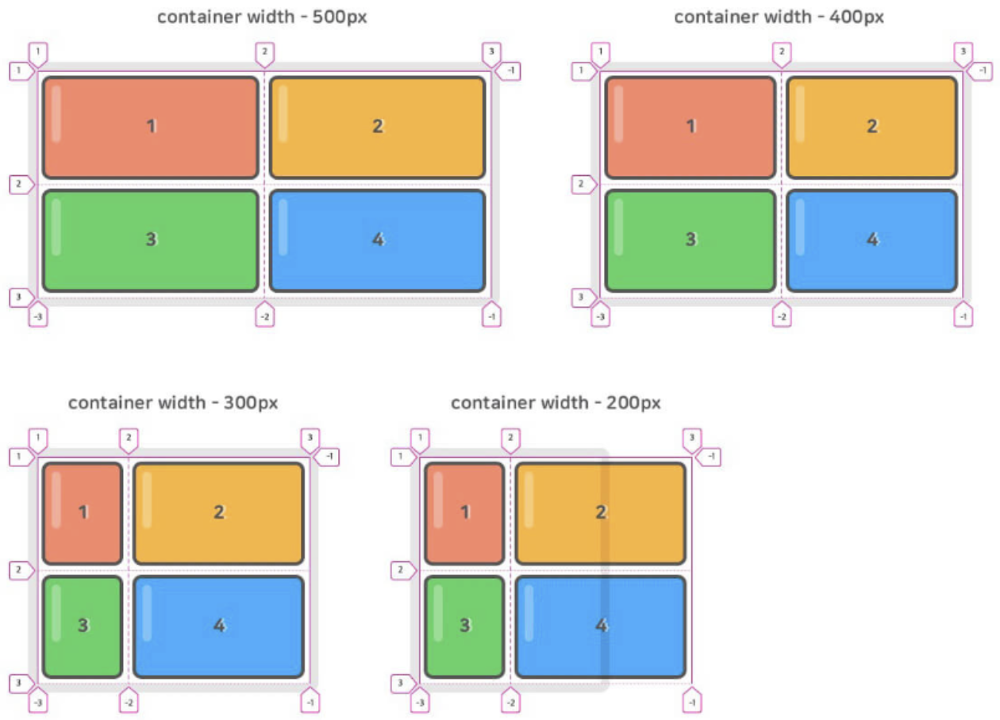

---
- fit-content()
  - fit-content() 함수는 행/열(Track)의 크기를 그리드 아이템(Item)이 포함하는 내용(Contents) 크기에 맞춥니다.
  - ‘내용의 최대 크기’를 인수로 사용합니다.
  - minmax(auto, max-content)와 유사합니다.

```css
.container {
  grid-template-columns: fit-content(300px) fit-content(300px);
}
```
---
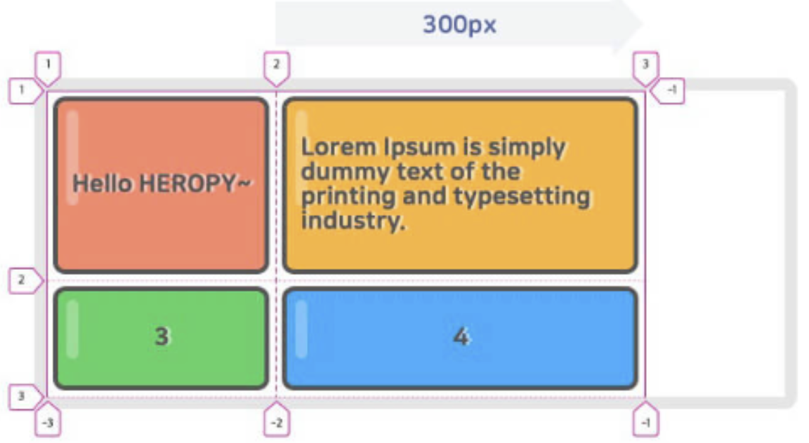

---
# Grid Units
그리드에서 사용하는 주요 단위들에 대해서 알아봅시다.
- fr
  - fr(fractional unit)은 사용 가능한 공간에 대한 비율을 의미합니다.

다음 예제는 그리드 컨테이너의 3번째 컬럼에 100px, 4번째 컬럼에 25%를 사용하고 남은 공간을 1번째 컬럼에 ‘1/3’, 2번째 컬럼에 ‘2/3’ 만큼 사용합니다.

```css
.container {
  grid-template-columns: 1fr 2fr 100px 25%;
}
```
---
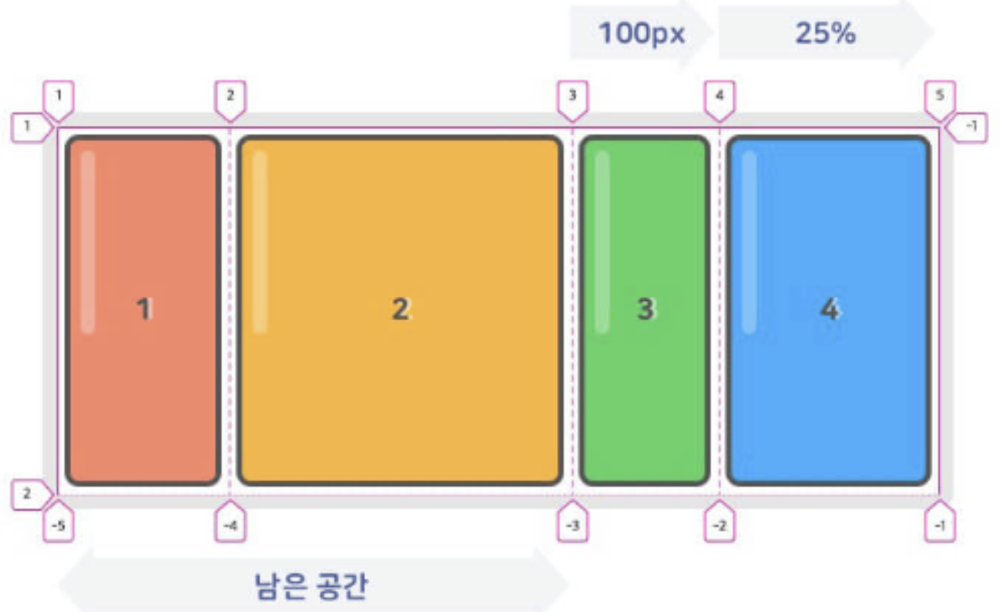

---
- min-content
  - 그리드 아이템이 포함하는 내용(Contents)의 최소 크기를 의미합니다.

```css
.container {
  grid-template-columns: min-content 1fr;
}
```
---


---
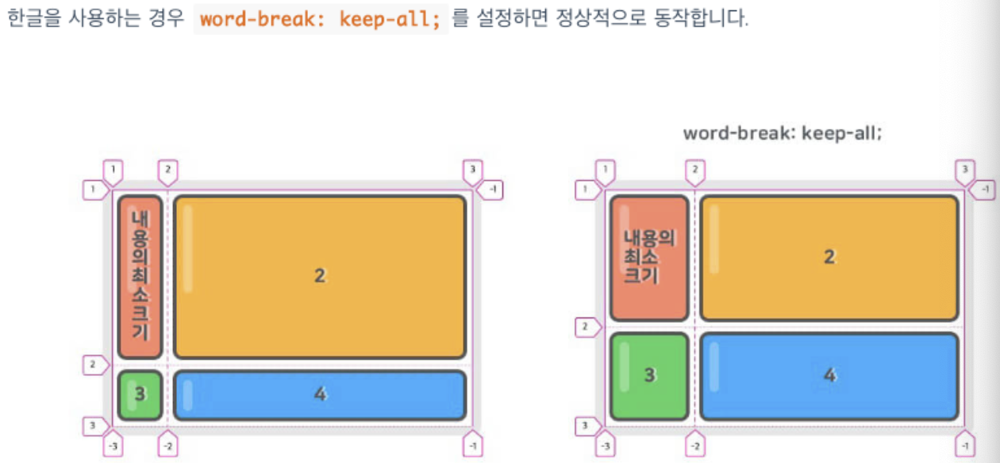

---
- max-content
  - 그리드 아이템이 포함하는 내용(Contents)의 최대 크기를 의미합니다.

```css
.container {
  grid-template-columns: max-content 1fr;
}
```

다음 예제는 총 4컬럼 그리드를 생성하며 각 열(Track)은 최대 1fr 크기를 가지지만, max-content를 통해 포함된 그리드 아이템의 내용보다 작아질 수 없습니다.
```css
.container {
  grid-template-columns: repeat(4, minmax(max-content, 1fr));
}
```
---
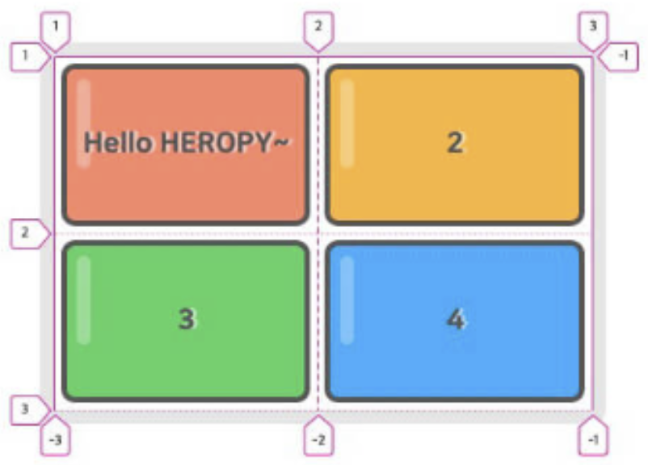

---
- auto-fill, auto-fit
  - auto-fill과 auto-fit은 차이점은 그리드 컨테이너가 하나의 행/열(Track)에 모든 아이템을 수용하고 남는 공간이 있을 때 발생합니다.
  - 다음과 같이 auto-fill은 남는 공간(빈 트랙)을 그대로 유지하고, auto-fit은 남는 공간을 축소합니다.

```css
.container.auto-fill {
  grid-template-columns: repeat(auto-fill, minmax(120px, 1fr));
}
.container.auto-fit {
  grid-template-columns: repeat(auto-fit, minmax(120px, 1fr));
}
```
---
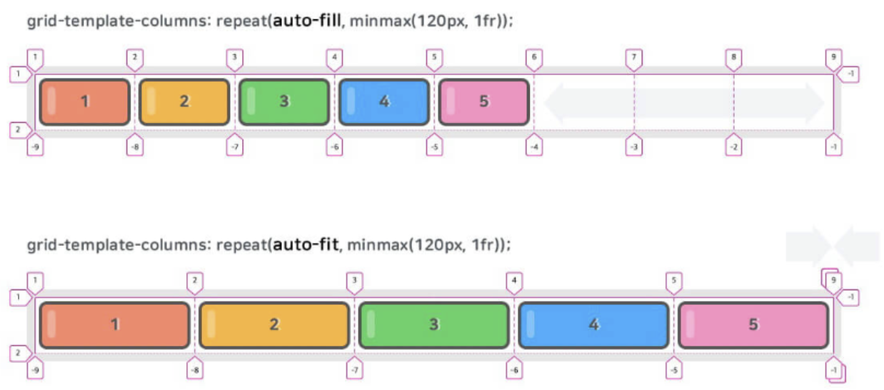


