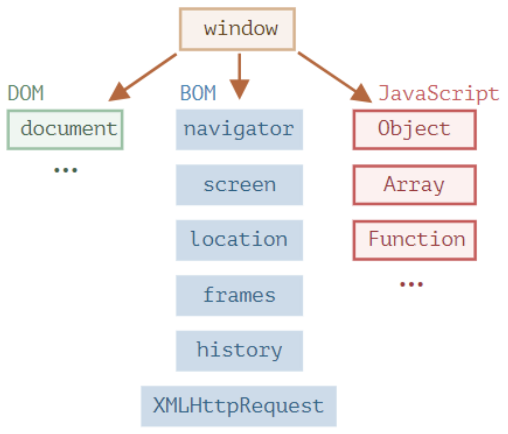

# [window](https://ko.javascript.info/browser-environment)
최상단엔 window라 불리는 ‘루트’ 객체가 있습니다. window 객체는 2가지 역할을 합니다.

1. 전역 객체 챕터에서 설명한 바와 같이, 자바스크립트 코드의 전역 객체입니다.
2. '브라우저 창(browser window)'을 대변하고, 이를 제어할 수 있는 메서드를 제공합니다.

아래 예시에선 window 객체를 전역 객체로 사용하고 있습니다.

```javascript
function sayHi() {
  alert("안녕하세요.");
}

// 전역 함수는 전역 객체(window)의 메서드임
window.sayHi();
```

---


---
# BOM(Browser Object Model)
브라우저 객체 모델(Browser Object Model, BOM)은 문서 이외의 모든 것을 제어하기 위해 브라우저(호스트 환경)가 제공하는 추가 객체를 나타냅니다.
## [navigator](http://www.tcpschool.com/javascript/js_bom_navigator)
navigator 객체는 브라우저와 운영체제에 대한 정보를 제공합니다.

```javascript
document.write("현재 사용 중인 브라우저의 이름은 " + navigator.appName + "입니다.<br>");

document.write("또한, 해당 브라우저의 코드명은 " + navigator.appCodeName + "입니다.");

document.write("현재 사용 중인 브라우저의 버전 정보는 " + navigator.appVersion + "입니다.<br><br>");

document.write("userAgent 프로퍼티로 알 수 있는 추가 정보는 " + navigator.userAgent + "입니다.");

document.write("현재 브라우저가 실행되고 있는 운영체제는 " + navigator.platform + "입니다.");

document.write("현재 브라우저의 기본 언어 설정은 " + navigator.language + "입니다.");
```

---
## [location](http://www.tcpschool.com/javascript/js_bom_location)
location 객체는 현재 URL을 읽을 수 있게 해주고 새로운 URL로 변경(redirect)할 수 있게 해줍니다.

```javascript
document.write("현재 문서의 주소는 " + location.href + "입니다.<br>");

document.write("현재 문서의 호스트 이름은 " + location.hostname + "입니다.<br>");

document.write("현재 문서의 파일 경로명은 " + location.pathname + "입니다.<br>");
```

---
- assign()
> 브라우저 창에 지정된 URL 주소에 존재하는 문서를 불러옵니다.

```javascript
function openDocument() {

    location.assign("/index.php");

}
```

- replace()
> 새 문서를 불러오기 전에, 현재 문서를 브라우저의 히스토리에서 제거한다는 점이 assign() 메소드와 다릅니다.

```javascript
function openDocumentWithReplace() {

    location.replace("/index.php");

}
```
---
# DOM(Document Object Model, DOM)
문서 객체 모델(Document Object Model, DOM)은 웹 페이지 내의 모든 콘텐츠를 객체로 나타내줍니다. 이 객체는 수정 가능합니다.

```javascript
// 배경을 붉은색으로 변경하기
document.body.style.background = "red";

// 1초 후 원상태로 복구하기
setTimeout(() => document.body.style.background = "", 1000);
```

---
# [자바스크립트 적용](http://www.tcpschool.com/javascript/js_intro_apply)
- 내부 자바스크립트 적용
```html
<script>
alert("내부 자바스크립트");
</script>
```
- 외부 자바스크립트 적용
```html
<script src="/examples/test.js"></script>
```


