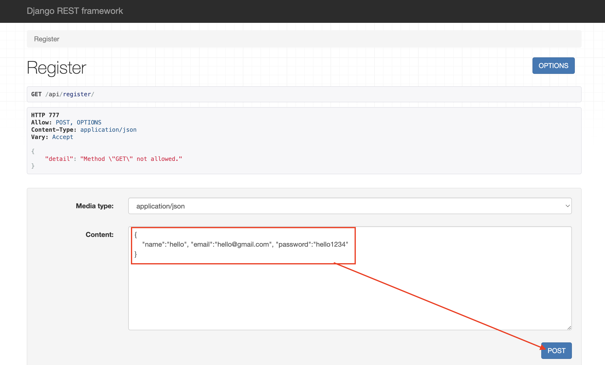
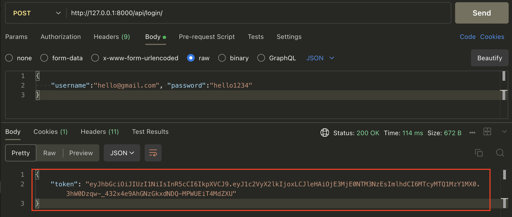
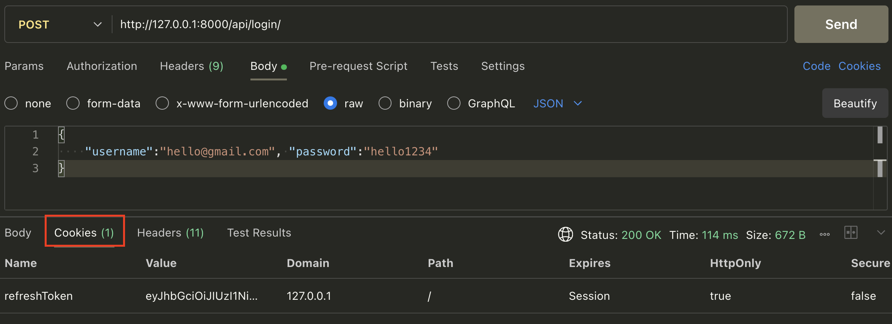
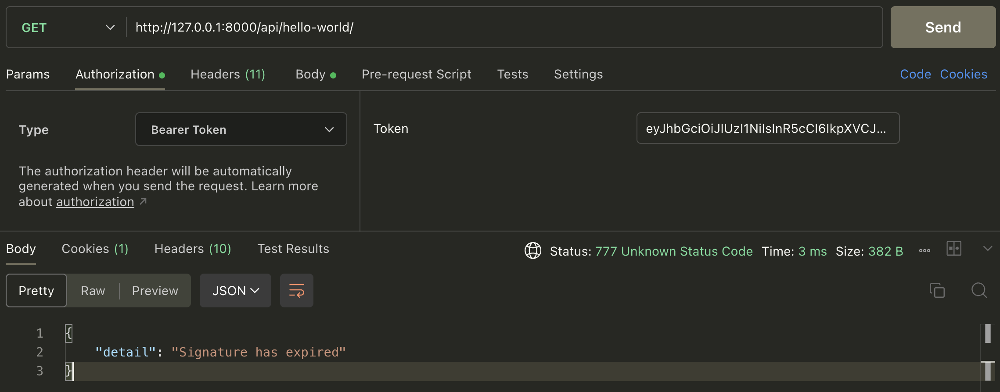
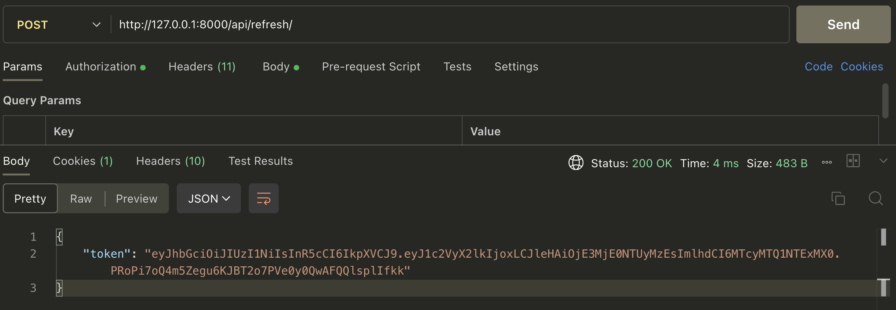

# [CORS 크로스 도메인](https://oen-blog.tistory.com/46)

---
# [JWT(Json Web Token)](https://juneyr.dev/2018-01-28/making-token-pyjwt)

---
# [Django REST Framework](https://blog.nerdfactory.ai/2021/02/24/creating-an-api-&-collecting-html-elements-with-django-rest-framework.html)

---
# 프로젝트 생성

---
### 단계1: 모듈 추가 설치
```shell
pip install django
pip install djangorestframework
pip install django-cors-headers
pip install PyJWT
```
### 단계2: 프로젝트 & 앱 생성
```shell
django-admin startproject config . 
python manage.py startapp api
python manage.py startapp user
python manage.py startapp authentication
```

---
### 단계3: settings.py
- 앱 추가 
```python
INSTALLED_APPS = [
    ...,
    "rest_framework", 
    "corsheaders",
    "api",
    "user",
    "authentication"
]
```
- User Model 설정 
```python
AUTH_USER_MODEL = "user.User"
```
---
- CORS 크로스 도메인 설정
```python
MIDDLEWARE = [
    "corsheaders.middleware.CorsMiddleware", # 맨위에 추가!!
    ...
]

CORS_ORIGIN_ALLOW_ALL = True
CORS_ALLOW_CREDENTIALS = True
```
- Django REST Framework 설정 
```python
REST_FRAMEWORK = {
    'EXCEPTION_HANDLER': 'authentication.exceptions.status_code_handler'
}
```

---
### 단계4: [User Models 생성](https://www.coninggu.com/8) 
- user.models.py
```python
from django.contrib.auth.models import AbstractUser
from django.db import models

# Create your models here.
class User(AbstractUser):
  name = models.CharField(max_length=255)
  ...
```

---
### 단계5: User Serializer 생성 
- 생성: user.serializer.py
```python
from rest_framework.serializers import ModelSerializer
from .models import User

# api통신때 user정보를 제공하기 위한 객체 
class UserSerializer(ModelSerializer):
    class Meta:
        model = User
        ...
```

---
### 단계6: exceptions 처리 
- 생성: authentication.exceptions.py
```python
from rest_framework.views import exception_handler 

def status_code_handler(exc, context):
    response = exception_handler(exc, context)

    if response is not None:
        response.status_code = 777
        ...
```

---
### 단계7: Json Web Token
- 생성: authentication.token.py
```python
import jwt 
import datetime 
import enum 

from rest_framework.exceptions import AuthenticationFailed

class JWT_KEY(enum.Enum):
    RANDOM_OF_ACCESS_KEY = (enum.auto(), 'access_secret', datetime.timedelta(seconds=120), 'HS256', '랜덤한 조합의 키')
    RANDOM_OF_REFRESH_KEY = (enum.auto(), 'refresh_secret', datetime.timedelta(days=2), 'HS256', '랜덤한 조합의 키')

...
```

---
### 단계8: api.views.py 
```python
from rest_framework.authentication import get_authorization_header
from rest_framework.views import APIView 
from rest_framework.response import Response 
from rest_framework.exceptions import AuthenticationFailed , APIException

from user.models import User
from user.serializer import UserSerializer
from authentication.token import create_access_token, create_refresh_token, decode_access_token, decode_refresh_token

# Create your views here.
class Register(APIView):
    def post(self, request):
        serializer = UserSerializer(data=request.data)
        serializer.is_valid(raise_exception=True)
```

---
### 단계9: api.urls.py 
```python
from django.urls import path
from .views import Register, LoginView, HelloWorldView, RefreshView, Logoutview

urlpatterns = [
    path('register/', Register.as_view(), name='register'),
    path('login/', LoginView.as_view(), name='login'),
    path('hello-world/', HelloWorldView.as_view(), name='hello-world'),
```

---
### 단계10: config.urls.py 
```python
from django.contrib import admin
from django.urls import path, include 

urlpatterns = [
    path("api/", include("api.urls"))
]
```

---
# 실행

---
### 단계1: 마이그레이션(migration)
```shell
$ (.venv) python manage.py makemigrations 
```
### 단계2: Database에 마이그레이션 정보 반영 
```shell
$ (.venv) python manage.py migrate
```
### 단계3: server 실행 및 관리자 페이지 접속 
```shell
$ (.venv) python manage.py runserver
``` 

---
# 테스트 

---
### 단계1: register
- http://127.0.0.1:8000/api/register/
```json
{
    "name":"hello", "email":"hello@gmail.com", "password":"hello1234"
}
```

---


---
- 결과 확인: 비밀번호는 보이지 않음!! 


---
- database에서 신규 회원 데이터 확인 
    - 비밀번호는 hashing 처리!!


---
### 단계2: login on postman
- http://127.0.0.1:8000/api/login/
```json
{
    "username":"hello@gmail.com", "password":"hello1234"
}
```


---
- 결과 확인: access token 확인 



---
- 결과 확인: refresh token 확인 



---
### 단계3: hello world on postman
- http://127.0.0.1:8000/api/hello-world/
> 로그인 한 경우에만 접속 가능!!


---
- 결과 확인: 2분 이내로 호출해야함!!


---
- 결과 확인: 2분이 지났기 때문에 access token이 만료됨 



---
### 단계4: refresh token을 이용한 access token 생성
- http://127.0.0.1:8000/api/refresh/



---
### 단계5: logout
- http://127.0.0.1:8000/api/logout/
> logout을 하면 쿠기에 있는 refresh token 삭제됨 


---
# 참고문서

### Youtube
- [Django API Authentication using JWT Tokens](https://www.youtube.com/watch?v=PUzgZrS_piQ&t=800s)
- [Django Login using Access & Refresh Tokens](https://www.youtube.com/watch?v=l6Pfu4L_y_k)
- [How to use JWT Authentication with Django Rest Framework](https://www.youtube.com/watch?v=BmOKr-cMhVA)
### Github: 
- [Django API Authentication using JWT Tokens](https://github.com/scalablescripts/django-auth)
- [Django Login using Access & Refresh Tokens](https://github.com/scalablescripts/django-auth-refresh)
