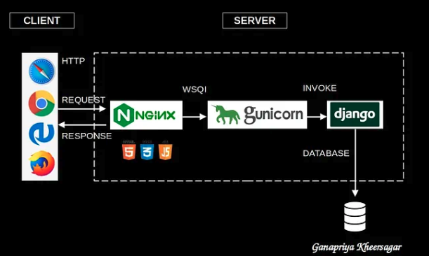
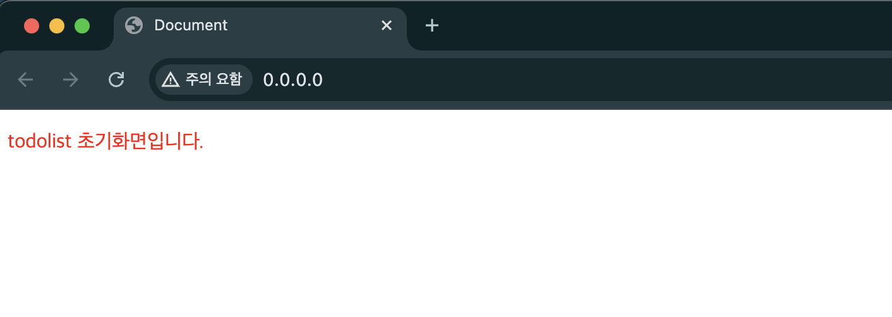
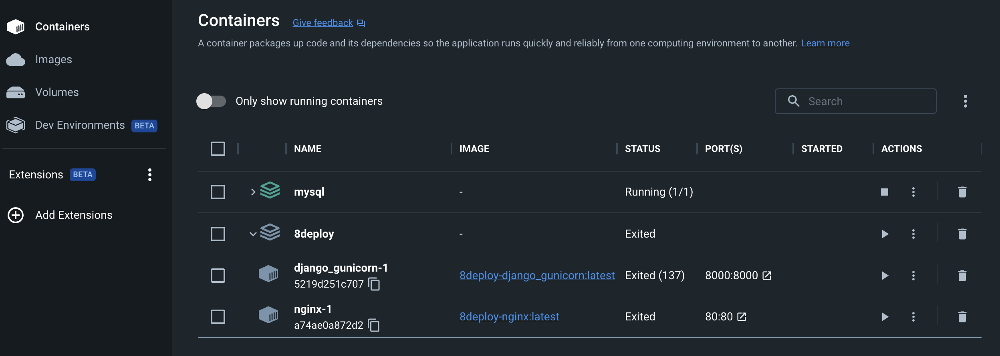

# [Hosting Django application with Nginx and Gunicorn](https://medium.com/@ganapriyakheersagar/hosting-django-application-with-nginx-and-gunicorn-in-production-99e64dc4345a)


---
### Django
- Django 내장 서버는 보안과 성능테스트를 거치지 않았기에 개발용으로만 사용하고, 실제 운영중인 환경 구축은 wsgi와 웹서버로 서비스하도록 권장하고 있습니다.

### WSGI(WebServer Gateway Interface)
- 파이썬 애플리케이션이 웹서버와 통신하기 위한 인터페이스로 웹서버의 요청을 해석을 해서 파이썬애플리케이션에게 전달해줍니다. 
- 대표적으로 gunicorn과 uWSGI가 있습니다.

---
### Gunicorn
- 애플리케이션 웹 서버인 Gunicorn은 WSGI와 호환됩니다. Flask나 Django와 같이 WSGI(Web Server Gateway Interface)를 지원하는 다른 애플리케이션과 통신할 수 있습니다.
- Gunicorn은 로컬 Django 서버처럼 정적 파일을 자동으로 제공할 수 없습니다. 따라서 이를 위해서는 다시 nginx가 필요합니다.

### Nginx
- Nginx는 높은 성능과 안정성 그리고 현재 가장 많이 사용되고 있는 웹 서버입니다. 
- Apache 같은 웹 서버와 비교하면 더 빠르고, 대규모 애플리케이션 처리에 적합하다는 장점이 있습니다. 

---
# 1. Django Project
- 프로젝트 참고: `1.create_django`
```shell
# 프로젝트 생성 
django-admin startproject config .
# 앱 생성  
python manage.py startapp todolist
python manage.py startapp user
```

---
# 2. Add Gunicorn

---
### 단계1: Gunicorn 설치
- requirements.txt
```shell
Django==3.0.8
gunicorn==20.0.4
...
```
- Dockerfile
```docker
FROM python:3.12-alpine

RUN pip install --upgrade pip

COPY ./requirements.txt .
RUN pip install -r requirements.txt
...
```
---
### 단계2: Gunicorn server 적용
- entrypoint.sh
```shell
...
python manage.py makemigrations --no-input
python manage.py migrate --no-input
python manage.py collectstatic --no-input
...
gunicorn config.wsgi:application --bind 0.0.0.0:8000
```

---
# 3. Add Nginx

---
### 단계1: Nginx 설정 
- default.conf
```conf
upstream django {
	server django_gunicorn:8000;
}

server {
	listen 80;
```
---
### 단계2: Nginx 컨테이너 
- Dockerflie
```docker
FROM nginx

COPY ./default.conf /etc/nginx/conf.d/default.conf
...
```

---
# 실행 

---
### 단계1: docker-compose 실행 
```shell
docker-compose up --build
```


---
### 단계2: docker desktop 확인 


---
### 단계3: nginx를 통한 Django 접속 
- http://0.0.0.0/



---
### 단계4: nginx에 저장된 정적 파일 확인 


---


---
### 단계5: gunicorn를 통한 Django 접속 
- http://0.0.0.0:8000/
  - 정적파일(js,css)들을 제공하지 못함


---
### 단계6: nginx & django_gunicorn stop
- 서버 스탑: `Ctrl + c`


---
- docker desktop 확인


---
# 참고문서
- https://www.youtube.com/watch?v=vJAfq6Ku4cI
