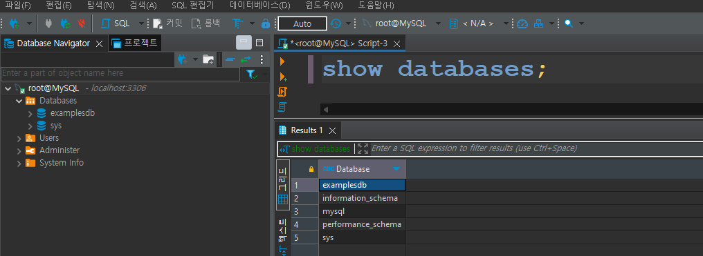

# [MySQL 접속확인](https://github.com/good593/course_sql/tree/main) 


---
# [SQLConnection](https://docs.streamlit.io/develop/api-reference/connections/st.connections.sqlconnection)


---
### 단계1: install SQLAlchemy
```shell
pip install SQLAlchemy
```


---
### 단계2: install mysqlclient
```shell
pip install mysqlclient
```


- [install mysqlclient on Mac M1](https://stackoverflow.com/questions/76876823/cannot-install-mysqlclient-on-macos)
```shell
# Assume you are activating Python 3 venv
$ brew install mysql-client pkg-config
$ export PKG_CONFIG_PATH="/opt/homebrew/opt/mysql-client/lib/pkgconfig"
$ (.venv) pip install mysqlclient
```

---
### 단계3: MySQL 접속 정보설정(https://docs.streamlit.io/develop/api-reference/connections/secrets.toml)
- 참고파일: `./.streamlit/secrets.toml`
```toml
[connections.mydb]
dialect = "mysql"
username = "root"
password = "root1234"
host = "localhost"
database = "examplesdb"
```

---
### 단계4: MySQL 접속
```shell
streamlit run ex-01.py
```


